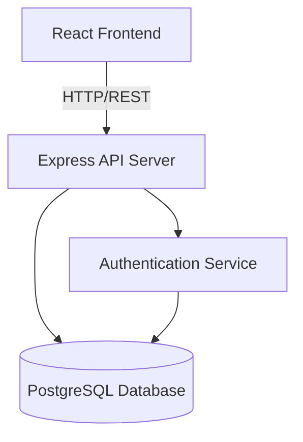
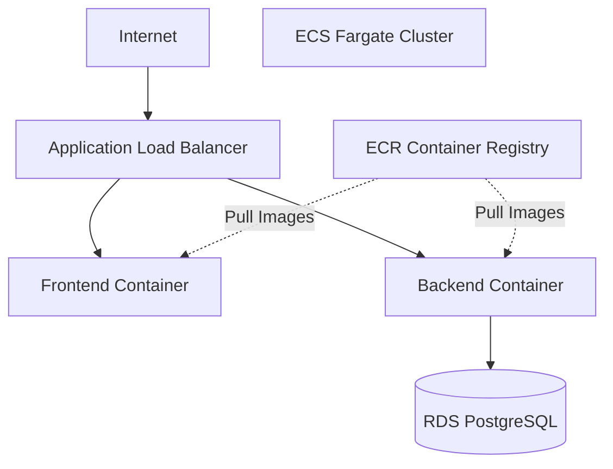

# Design Document - Overezee

## Overview

Overezee is a full-stack web application for recipe management and meal planning. The system follows a three-tier architecture with a React-based frontend, Node.js/Express backend API, and PostgreSQL database. The application supports user authentication, role-based access control, and provides both manual and automated meal planning capabilities.

## Architecture

### High-Level Architecture



### Technology Stack

**Frontend:**
- React 18 with TypeScript
- React Router for navigation
- Axios for API communication
- CSS Modules for styling
- React Hook Form for form management

**Backend:**
- Node.js with Express
- TypeScript
- JWT for authentication
- bcrypt for password hashing
- PostgreSQL client (pg)

**Database:**
- PostgreSQL 14+ (AWS RDS)

**Infrastructure:**
- AWS ECS Fargate for containerized deployment
- AWS RDS for PostgreSQL database
- AWS Application Load Balancer
- AWS ECR for container registry
- Docker for containerization

**Development Tools:**
- Vite for frontend build
- ESLint and Prettier for code quality
- Docker Compose for local development

## Components and Interfaces

### Frontend Components

#### 1. Authentication Components
- `LoginForm`: Handles user login (Req 9)
- `RegisterForm`: Handles user registration (Req 9)
- `AuthProvider`: Context provider for authentication state

#### 2. Recipe Components
- `RecipeList`: Displays all recipes with search and filter (Req 2, 8)
- `RecipeCard`: Individual recipe preview with tags
- `RecipeDetail`: Full recipe view with edit/delete options (Req 2, 3, 4)
- `RecipeForm`: Create/edit recipe form with tag selection (Req 1, 3)
- `RecipeSearch`: Search and filter interface (Req 8)

#### 3. Meal Planning Components
- `MealPlanCalendar`: Calendar view of meal plans (Req 6)
- `MealPlanEntry`: Individual meal plan item (Req 5, 7)
- `MealPlanForm`: Manual meal plan creation (Req 5)
- `AutoGenerateForm`: Automated meal plan generation interface (Req 13)

#### 4. Admin Components
- `AdminDashboard`: Statistics and overview (Req 12)
- `UserManagement`: User list and management (Req 10, 11)
- `AdminRoute`: Protected route wrapper for admin access

### Backend API Endpoints

#### Authentication Endpoints
```
POST /api/auth/register
POST /api/auth/login
GET /api/auth/me
```

#### Recipe Endpoints
```
GET /api/recipes - List all recipes for authenticated user
GET /api/recipes/:id - Get single recipe
POST /api/recipes - Create new recipe
PUT /api/recipes/:id - Update recipe
DELETE /api/recipes/:id - Delete recipe
GET /api/recipes/search?q=&tags= - Search and filter recipes
```

#### Meal Plan Endpoints
```
GET /api/meal-plans?startDate=&endDate= - Get meal plans for date range
POST /api/meal-plans - Create meal plan entry
PUT /api/meal-plans/:id - Update meal plan entry
DELETE /api/meal-plans/:id - Delete meal plan entry
POST /api/meal-plans/auto-generate - Auto-generate meal plans
```

#### Admin Endpoints
```
GET /api/admin/users - List all users
PUT /api/admin/users/:id/disable - Disable user account
DELETE /api/admin/users/:id - Delete user account
GET /api/admin/statistics - Get system statistics
```

### Middleware

- `authenticate`: Verifies JWT token and attaches user to request
- `requireAdmin`: Ensures user has admin role
- `validateRequest`: Validates request body against schema
- `errorHandler`: Centralized error handling

## Data Models

### User Model
```typescript
interface User {
  id: string;
  email: string;
  passwordHash: string;
  role: 'user' | 'admin';
  isActive: boolean;
  createdAt: Date;
  updatedAt: Date;
}
```

### Recipe Model
```typescript
interface Recipe {
  id: string;
  userId: string;
  title: string;
  ingredients: string[];
  instructions: string;
  preparationTime: number; // minutes
  tags: RecipeTag[];
  createdAt: Date;
  updatedAt: Date;
}

type RecipeTag = 
  | 'kid-friendly'
  | 'gluten-free'
  | 'low-carb'
  | 'sunday-dinner'
  | 'vegetarian'
  | 'vegan'
  | 'dairy-free';
```

### MealPlan Model
```typescript
interface MealPlan {
  id: string;
  userId: string;
  recipeId: string;
  date: Date;
  mealTime: 'breakfast' | 'lunch' | 'dinner';
  createdAt: Date;
  updatedAt: Date;
}
```

### Database Schema

```sql
-- Users table
CREATE TABLE users (
  id UUID PRIMARY KEY DEFAULT gen_random_uuid(),
  email VARCHAR(255) UNIQUE NOT NULL,
  password_hash VARCHAR(255) NOT NULL,
  role VARCHAR(20) DEFAULT 'user',
  is_active BOOLEAN DEFAULT true,
  created_at TIMESTAMP DEFAULT CURRENT_TIMESTAMP,
  updated_at TIMESTAMP DEFAULT CURRENT_TIMESTAMP
);

-- Recipes table
CREATE TABLE recipes (
  id UUID PRIMARY KEY DEFAULT gen_random_uuid(),
  user_id UUID REFERENCES users(id) ON DELETE CASCADE,
  title VARCHAR(255) NOT NULL,
  ingredients TEXT[] NOT NULL,
  instructions TEXT NOT NULL,
  preparation_time INTEGER,
  tags TEXT[],
  created_at TIMESTAMP DEFAULT CURRENT_TIMESTAMP,
  updated_at TIMESTAMP DEFAULT CURRENT_TIMESTAMP
);

-- Meal plans table
CREATE TABLE meal_plans (
  id UUID PRIMARY KEY DEFAULT gen_random_uuid(),
  user_id UUID REFERENCES users(id) ON DELETE CASCADE,
  recipe_id UUID REFERENCES recipes(id) ON DELETE CASCADE,
  date DATE NOT NULL,
  meal_time VARCHAR(20) NOT NULL,
  created_at TIMESTAMP DEFAULT CURRENT_TIMESTAMP,
  updated_at TIMESTAMP DEFAULT CURRENT_TIMESTAMP,
  UNIQUE(user_id, date, meal_time)
);

-- Indexes
CREATE INDEX idx_recipes_user_id ON recipes(user_id);
CREATE INDEX idx_recipes_tags ON recipes USING GIN(tags);
CREATE INDEX idx_meal_plans_user_date ON meal_plans(user_id, date);
```

## Error Handling

### Error Response Format
```typescript
interface ErrorResponse {
  error: {
    message: string;
    code: string;
    details?: any;
  };
}
```

### Error Categories

1. **Authentication Errors (401)**
   - Invalid credentials
   - Expired token
   - Missing token

2. **Authorization Errors (403)**
   - Insufficient permissions
   - Admin access required

3. **Validation Errors (400)**
   - Missing required fields
   - Invalid data format
   - Constraint violations

4. **Not Found Errors (404)**
   - Resource not found
   - User not found

5. **Server Errors (500)**
   - Database connection errors
   - Unexpected errors

### Frontend Error Handling

- Display user-friendly error messages
- Toast notifications for transient errors
- Form validation errors inline
- Retry mechanism for network failures
- Fallback UI for critical errors

## Authentication and Authorization

### Authentication Flow

1. User submits credentials to `/api/auth/login`
2. Server validates credentials against database
3. Server generates JWT token with user ID and role
4. Client stores token in localStorage
5. Client includes token in Authorization header for subsequent requests
6. Server validates token on protected routes

### JWT Token Structure
```typescript
interface JWTPayload {
  userId: string;
  email: string;
  role: 'user' | 'admin';
  iat: number;
  exp: number;
}
```

### Authorization Rules

- All recipe and meal plan endpoints require authentication
- Users can only access their own recipes and meal plans
- Admin endpoints require admin role
- Admin users can access all user data

## Auto-Generate Meal Plan Algorithm

### Algorithm Overview (Req 13)

```typescript
interface AutoGenerateParams {
  startDate: Date;
  endDate: Date;
  mealsPerDay: ('breakfast' | 'lunch' | 'dinner')[];
  tags?: RecipeTag[];
}

function autoGenerateMealPlan(params: AutoGenerateParams): MealPlan[] {
  // 1. Fetch eligible recipes matching tag criteria
  // 2. Shuffle recipes for variety
  // 3. For each date in range:
  //    - For each meal time:
  //      - Select next recipe from shuffled list
  //      - Ensure recipe not used in past 7 days
  //      - Create meal plan entry
  //      - Move to next recipe
  // 4. Return generated meal plans
}
```

### Algorithm Details

1. **Recipe Selection**: Query recipes matching specified tags (AND logic for multiple tags)
2. **Variety Enforcement**: Track last 7 days of used recipes, exclude from selection
3. **Distribution**: Rotate through available recipes to maximize variety
4. **Fallback**: If insufficient recipes for criteria, allow repeats after exhausting options

## Testing Strategy

### Unit Tests

**Backend:**
- Authentication service (login, register, token validation)
- Recipe service (CRUD operations, search, filtering)
- Meal plan service (CRUD, auto-generation algorithm)
- Admin service (user management, statistics)
- Middleware (authentication, authorization, validation)

**Frontend:**
- Form validation logic
- Authentication context
- API client functions
- Utility functions (date formatting, tag display)

### Integration Tests

- API endpoint tests with test database
- Authentication flow end-to-end
- Recipe CRUD operations
- Meal plan creation and retrieval
- Admin operations
- Auto-generate meal plan feature

### End-to-End Tests

- User registration and login flow
- Create, edit, delete recipe
- Search and filter recipes
- Create manual meal plan
- Auto-generate meal plan
- Admin user management

### Performance Tests

- Recipe list load time (< 3 seconds, Req 2)
- Search response time (< 1 second, Req 8)
- Meal plan load time (< 3 seconds, Req 6)
- Admin dashboard load time (< 5 seconds, Req 12)
- Recipe save confirmation (< 2 seconds, Req 1)

## Security Considerations

1. **Password Security**: Use bcrypt with salt rounds of 10+
2. **JWT Security**: Use strong secret, set reasonable expiration (24 hours)
3. **Input Validation**: Validate and sanitize all user inputs
4. **SQL Injection**: Use parameterized queries
5. **XSS Protection**: Sanitize user-generated content
6. **CORS**: Configure appropriate CORS policies
7. **Rate Limiting**: Implement rate limiting on authentication endpoints
8. **HTTPS**: Enforce HTTPS in production

## Performance Optimization

1. **Database Indexing**: Index foreign keys and frequently queried fields
2. **Query Optimization**: Use efficient queries with proper joins
3. **Caching**: Cache frequently accessed data (recipe lists, tags)
4. **Pagination**: Implement pagination for large recipe lists
5. **Lazy Loading**: Load recipe details on demand
6. **Bundle Optimization**: Code splitting for frontend routes
7. **Image Optimization**: Compress and resize recipe images (future enhancement)

## Deployment Architecture

### AWS Infrastructure



### Container Configuration

**Frontend Container (Nginx):**
- Serves static React build
- Proxies API requests to backend
- Port 80

**Backend Container:**
- Node.js Express application
- Port 3000
- Environment variables for database connection

### Dockerfile Structure

**Frontend Dockerfile:**
```dockerfile
FROM node:18-alpine AS builder
WORKDIR /app
COPY package*.json ./
RUN npm ci
COPY . .
RUN npm run build

FROM nginx:alpine
COPY --from=builder /app/dist /usr/share/nginx/html
COPY nginx.conf /etc/nginx/conf.d/default.conf
EXPOSE 80
```

**Backend Dockerfile:**
```dockerfile
FROM node:18-alpine
WORKDIR /app
COPY package*.json ./
RUN npm ci --only=production
COPY . .
RUN npm run build
EXPOSE 3000
CMD ["node", "dist/server.js"]
```

### ECS Task Definition

- CPU: 512 (0.5 vCPU)
- Memory: 1024 MB
- Network Mode: awsvpc
- Launch Type: FARGATE

### Environment Variables

**Backend Container:**
- `DATABASE_URL`: RDS connection string
- `JWT_SECRET`: Secret for JWT signing
- `NODE_ENV`: production
- `PORT`: 3000

### Database Configuration

**RDS PostgreSQL:**
- Instance class: db.t3.micro (can scale up)
- Multi-AZ: false (enable for production)
- Automated backups: enabled
- Backup retention: 7 days
- Security group: Allow access from ECS tasks only

### CloudFront CDN Configuration

**Distribution Setup:**
- Origin: Application Load Balancer
- Cache behavior: Cache static assets (JS, CSS, images)
- TTL: 1 day for static assets, no cache for API calls
- HTTPS only with ACM certificate
- Compression enabled (gzip, brotli)

**Cache Policies:**
- Static assets: `/assets/*` - cache for 1 day
- API requests: `/api/*` - no caching
- HTML: `/` - cache for 5 minutes

### Auto-Scaling Configuration

**ECS Service Auto-Scaling:**
- Target tracking scaling policy
- Metric: Average CPU utilization
- Target value: 70%
- Scale out: Add 1 task when CPU > 70% for 2 minutes
- Scale in: Remove 1 task when CPU < 50% for 5 minutes
- Min tasks: 2 (for high availability)
- Max tasks: 10

**RDS Auto-Scaling:**
- Enable storage auto-scaling
- Maximum storage threshold: 100 GB

### CI/CD Pipeline (GitHub Actions)

**Pipeline Stages:**

1. **Build and Test**
   - Trigger: Push to main branch or pull request
   - Run linting and type checking
   - Run unit tests
   - Build Docker images

2. **Push to ECR**
   - Authenticate with AWS
   - Tag images with commit SHA and 'latest'
   - Push to ECR repositories

3. **Deploy to ECS**
   - Update task definitions with new image tags
   - Update ECS service
   - Wait for deployment to stabilize
   - Run smoke tests

**GitHub Actions Workflow:**
```yaml
name: Deploy to AWS

on:
  push:
    branches: [main]

jobs:
  deploy:
    runs-on: ubuntu-latest
    steps:
      - Checkout code
      - Configure AWS credentials
      - Login to ECR
      - Build and push frontend image
      - Build and push backend image
      - Update ECS task definitions
      - Deploy to ECS
      - Run smoke tests
```

**Required GitHub Secrets:**
- `AWS_ACCESS_KEY_ID`
- `AWS_SECRET_ACCESS_KEY`
- `AWS_REGION`
- `ECR_FRONTEND_REPOSITORY`
- `ECR_BACKEND_REPOSITORY`
- `ECS_CLUSTER_NAME`
- `ECS_SERVICE_NAME`

### Deployment Process

1. Developer pushes code to main branch
2. GitHub Actions workflow triggers automatically
3. Build and test stages run
4. Docker images built and pushed to ECR
5. ECS task definitions updated with new image tags
6. ECS service updated, triggering rolling deployment
7. Health checks verify new tasks are healthy
8. Old tasks terminated after new tasks are stable
9. CloudFront cache invalidated for updated assets

### Monitoring and Logging

- CloudWatch Logs for container logs
- CloudWatch Metrics for resource utilization
- Application Load Balancer access logs
- RDS performance insights
- CloudWatch Alarms for critical metrics (CPU, memory, errors)
- CloudFront access logs and metrics

## Future Enhancements

1. Recipe images and photo upload (S3 storage)
2. Nutritional information tracking
3. Grocery list generation from meal plans
4. Recipe sharing between users
5. Recipe ratings and reviews
6. Serving size adjustments
7. Recipe import from URLs
8. Mobile application
9. Print-friendly recipe format
10. Recipe collections/cookbooks
